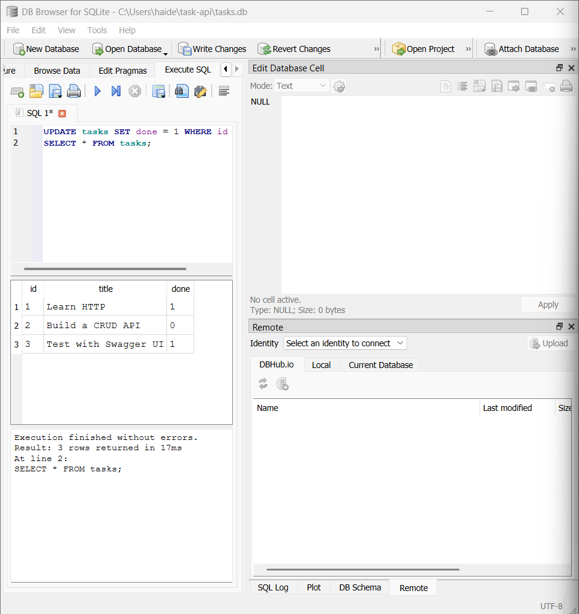
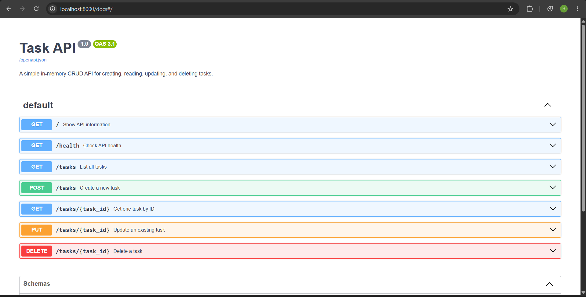

# Task API

A CRUD API built with Python, FastAPI, and SQLite.

The API allows users to create, read, update, and delete to-do tasks. It includes input validation, appropriate HTTP status codes, JSON error responses, persistent SQLite storage, and interactive Swagger UI documentation.

## Features

* Create a task
* List all tasks
* Retrieve one task by ID
* Update an existing task
* Delete a task
* Validate missing or empty titles
* Return appropriate HTTP status codes
* Store tasks persistently in SQLite
* Automatically create the database and tasks table
* Seed three example tasks when the database is empty
* Use parameterized SQL queries
* Test endpoints through Swagger UI
* Inspect the database using DB Browser for SQLite

## Technologies

* Python 3.10 or newer
* FastAPI
* Uvicorn
* Pydantic
* SQLite
* DB Browser for SQLite
* Git and GitHub

## Project Structure

```text
task-api/
|-- main.py
|-- requirements.txt
|-- README.md
|-- .gitignore
|-- tasks.db              # Generated automatically and ignored by Git
`-- screenshots/
    |-- swagger-ui.png
    `-- database-viewer.png
```

## Installation

### 1. Create a virtual environment

```powershell
python -m venv .venv
```

### 2. Activate the virtual environment

```powershell
.\.venv\Scripts\Activate.ps1
```

### 3. Install the dependencies

```powershell
python -m pip install -r requirements.txt
```

## Run the API

```powershell
python -m uvicorn main:app --reload
```

The API runs at:

```text
http://localhost:8000
```

Swagger UI is available at:

```text
http://localhost:8000/docs
```

## Endpoints

| Method | Endpoint           | Description                      | Success status   |
| ------ | ------------------ | -------------------------------- | ---------------- |
| GET    | `/`                | Show API information             | `200 OK`         |
| GET    | `/health`          | Check whether the API is running | `200 OK`         |
| GET    | `/tasks`           | List all tasks                   | `200 OK`         |
| GET    | `/tasks/{task_id}` | Retrieve one task by ID          | `200 OK`         |
| POST   | `/tasks`           | Create a new task                | `201 Created`    |
| PUT    | `/tasks/{task_id}` | Update an existing task          | `200 OK`         |
| DELETE | `/tasks/{task_id}` | Delete a task                    | `204 No Content` |

## Task Format

```json
{
  "id": 1,
  "title": "Learn HTTP",
  "done": false
}
```

## Example Request and Response

Command:

```powershell
curl.exe -i http://localhost:8000/health
```

Example response:

```http
HTTP/1.1 200 OK
content-type: application/json

{"status":"ok"}
```

## Status Codes

| Status code       | Meaning                                 |
| ----------------- | --------------------------------------- |
| `200 OK`          | A read or update succeeded              |
| `201 Created`     | A new task was created                  |
| `204 No Content`  | A task was deleted successfully         |
| `400 Bad Request` | The request body was missing or invalid |
| `404 Not Found`   | The requested task does not exist       |

## SQLite Storage

Tasks are stored in a SQLite database named:

```text
tasks.db
```

The database file is created automatically when the application starts.

The application also automatically creates the `tasks` table if it does not already exist.

If the table is empty, the following three example tasks are inserted:

1. Learn HTTP
2. Build a CRUD API
3. Test with Swagger UI

The seed data is only inserted when the table is empty, so restarting the server does not create duplicate tasks.

The `tasks.db` file is ignored by Git because each clone of the project can generate its own database automatically.

## Persistence

Unlike the previous in-memory version, tasks now survive server restarts.

Creating, updating, or deleting a task modifies `tasks.db`. Restarting FastAPI does not reset the task data.

## SQL and Parameterized Queries

The API communicates with SQLite using SQL.

Example:

```sql
SELECT * FROM tasks WHERE id = ?;
```

The `?` placeholder allows the task ID to be passed separately instead of inserting user input directly into the SQL string.

This is a parameterized query and helps prevent SQL injection.

## Database Exploration

The SQLite database was also inspected using DB Browser for SQLite.

Example query:

```sql
SELECT * FROM tasks WHERE done = 1;
```

This query returns only tasks whose `done` value is `1`, meaning the task is completed.

The API and DB Browser both access the same `tasks.db` file. A task changed directly in DB Browser was immediately reflected by the API without restarting the server.

## Database Screenshot



## Swagger UI

The complete CRUD cycle can also be tested through Swagger UI at:

```text
http://localhost:8000/docs
```



## Automatic Database Setup

A fresh copy of the project does not require a pre-existing database.

When the application starts:

1. `tasks.db` is created if it does not exist.
2. The `tasks` table is created if it does not exist.
3. Three example tasks are inserted if the table is empty.

This allows the project to run from a clean clone without manually creating the database.
