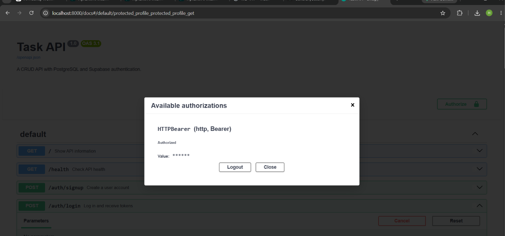

# Task API — PostgreSQL + Supabase Auth

FastAPI backend with PostgreSQL task CRUD plus Supabase authentication. The auth layer supports sign up, login, logout, JWT verification, reusable protected routes, and Swagger bearer authorization.

## Environment
Copy `.env.example` to `.env`, keep the PostgreSQL values, and set your own `SUPABASE_URL` and public anon `SUPABASE_KEY`. Never use the `service_role` key. `.env` is git-ignored. For this practice project, Supabase **Confirm email** is disabled.

## Run
```powershell
docker compose up --build
```
If Docker Compose Bake fails on Windows, run `$env:COMPOSE_BAKE="false"` first. API: `http://localhost:8000`; Swagger: `http://localhost:8000/docs`.

## Required auth API
| Method | Endpoint | Purpose | Auth | Success |
|---|---|---|---|---|
| POST | `/auth/signup` | Create user | No | 201 |
| POST | `/auth/login` | Return access + refresh tokens | No | 200 |
| POST | `/auth/logout` | End session | Bearer | 204 |
| GET | `/protected/profile` | Verified user metadata | Bearer | 200 |
| GET | `/public/info` | Public information | No | 200 |

`GET /protected/dashboard` is a second protected route using the same reusable FastAPI dependency.

## Error behavior
- Missing signup/login fields: `400` JSON error.
- Invalid login: `401 {"error":"Invalid login credentials"}`.
- Missing/malformed bearer token: `401 {"error":"Access token required"}`.
- Invalid/expired/tampered token: `401 {"error":"Invalid or expired token"}`.

## Auth flow
Supabase stores passwords and issues the JWT. Clients send `Authorization: Bearer <token>`. The dependency verifies the token using `supabase.auth.get_user(token)` before protected route logic runs.

## Swagger UI
FastAPI `HTTPBearer` adds lock icons to `/auth/logout`, `/protected/profile`, and `/protected/dashboard`. Click **Authorize**, paste the login `access_token`, and use **Try it out**.



## Existing task routes
The existing PostgreSQL-backed `/tasks` CRUD endpoints remain unchanged in purpose and continue to use Docker Compose and the `taskdata` volume.

## Required stage commits
- Stage 0: setup server and supabase client
- Stage 1: signup and login routes working
- Stage 2: public route and unverified protected route
- Stage 3: profile route token verification
- Stage 4: auth middleware and logout endpoint
- Stage 5: Swagger UI documentation with bearer auth
- Stage 6: publish to GitHub and write README

## Final verification
Run signup → login → valid protected call → tampered token 401 from the terminal, then repeat the protected call through Swagger Authorize/Try it out.

## Week 5 - The polite scraper

The Week 5 assignment is in [`scraper/`](scraper/README.md).

## Week 7 — LLM enrichment

Week 7 adds one narrow AI workflow to this existing API: a scraped book record goes in and a schema-controlled enrichment judgement comes out. The provider is not hard-coded: LLM_BASE_URL, LLM_API_KEY, and LLM_MODEL are environment variables, so the same integration can point at another OpenAI-compatible provider without changing route code.

Stage 0 job definition is in [JOB-CARD.md](JOB-CARD.md).
