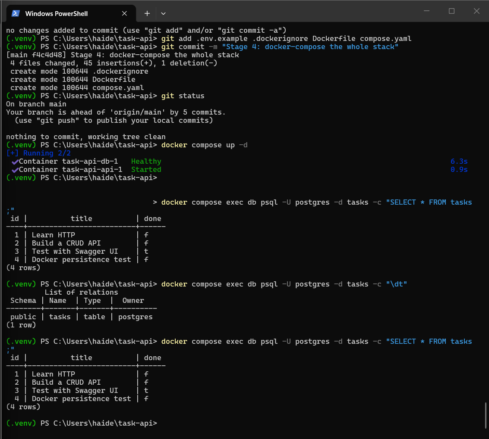

# Task API

A CRUD API built with Python, FastAPI, PostgreSQL, and Docker.

This project began with in-memory storage, moved to SQLite, and now uses a PostgreSQL database running in Docker. Docker Compose starts both the FastAPI application and PostgreSQL database together.

The API supports creating, reading, updating, and deleting tasks with validation, correct HTTP status codes, JSON error responses, persistent database storage, and Swagger UI documentation.

## Features

* Create a task
* List all tasks
* Retrieve one task by ID
* Update an existing task
* Delete a task
* Validate missing or empty titles
* Return appropriate HTTP status codes
* Store tasks persistently in PostgreSQL
* Run PostgreSQL inside Docker
* Start the API and database together with Docker Compose
* Persist database data using a Docker volume
* Automatically create the `tasks` table
* Seed three example tasks only when the table is empty
* Use parameterized SQL queries with Psycopg
* Load database configuration from environment variables
* Keep the real `.env` file out of Git
* Provide `.env.example` for setup

## Technologies

* Python 3.14
* FastAPI
* Uvicorn
* Pydantic
* PostgreSQL 16
* Psycopg 3
* python-dotenv
* Docker
* Docker Compose
* Git and GitHub

## Project Structure

```text
task-api/
|-- main.py
|-- repository.py
|-- requirements.txt
|-- Dockerfile
|-- compose.yaml
|-- .dockerignore
|-- .gitignore
|-- .env.example
|-- README.md
`-- screenshots/
    |-- swagger-ui.png
    |-- database-viewer.png
    `-- postgres-data.png
```

The real `.env` file is intentionally excluded from Git.

## Architecture

The current storage flow is:

```text
Client
  |
  v
FastAPI routes
  |
  v
repository.py
  |
  v
PostgreSQL
```

All PostgreSQL connection and SQL logic is kept inside `repository.py`.

The public API contract remains the same as the previous versions: the same endpoint paths, request shapes, response shapes, validation rules, and status codes are used.

The A2 version did not yet have a completely separate repository layer, so A3 required a one-time refactor of `main.py` so the routes delegate storage operations to `repository.py`. After that refactor, PostgreSQL-specific SQL is isolated in the repository module.

## Environment Variables

Create a local `.env` file from `.env.example`.

The project uses:

```text
POSTGRES_USER=postgres
POSTGRES_PASSWORD=dev
POSTGRES_DB=tasks
DATABASE_URL=postgresql://postgres:dev@db:5432/tasks
```

`.env` is listed in `.gitignore` and must not be committed.

Inside Docker Compose, the API connects to PostgreSQL using the service name:

```text
db
```

instead of `localhost`.

## Run the Whole Stack

From the project directory, create your local environment file.

PowerShell:

```powershell
Copy-Item .env.example .env
```

Then start the complete application stack:

```powershell
docker compose up --build
```

Docker Compose starts:

* `api` — the FastAPI application
* `db` — PostgreSQL 16

The API is available at:

```text
http://localhost:8000
```

Swagger UI is available at:

```text
http://localhost:8000/docs
```

To stop the stack:

```powershell
docker compose down
```

Do not use `docker compose down -v` if you want to keep the database data, because `-v` removes the volume.

## Docker Volume

PostgreSQL data is stored in a named Docker volume:

```text
taskdata
```

The Compose configuration mounts the volume to:

```text
/var/lib/postgresql/data
```

The volume exists independently of the running database container, so rows survive container restarts and normal `docker compose down` / `docker compose up` cycles.

## Automatic Database Setup

When the application starts, `repository.py` creates the table if it does not already exist:

```sql
CREATE TABLE IF NOT EXISTS tasks (
    id SERIAL PRIMARY KEY,
    title TEXT NOT NULL,
    done BOOLEAN NOT NULL DEFAULT FALSE
);
```

If the table is empty, three example tasks are inserted:

1. Learn HTTP
2. Build a CRUD API
3. Test with Swagger UI

The seed data is inserted only when the table is empty, preventing duplicate seed rows on restart.

## Endpoints

| Method | Endpoint           | Description                      | Success status   |
| ------ | ------------------ | -------------------------------- | ---------------- |
| GET    | `/`                | Show API information             | `200 OK`         |
| GET    | `/health`          | Check whether the API is running | `200 OK`         |
| GET    | `/tasks`           | List all tasks                   | `200 OK`         |
| GET    | `/tasks/{task_id}` | Retrieve one task by ID          | `200 OK`         |
| POST   | `/tasks`           | Create a task                    | `201 Created`    |
| PUT    | `/tasks/{task_id}` | Update a task                    | `200 OK`         |
| DELETE | `/tasks/{task_id}` | Delete a task                    | `204 No Content` |

## Task Format

```json
{
  "id": 1,
  "title": "Learn HTTP",
  "done": false
}
```

## Status Codes

| Status code       | Meaning                             |
| ----------------- | ----------------------------------- |
| `200 OK`          | A read or update succeeded          |
| `201 Created`     | A task was created                  |
| `204 No Content`  | A task was deleted                  |
| `400 Bad Request` | Request data was missing or invalid |
| `404 Not Found`   | The requested task does not exist   |

Errors are returned as JSON.

Example:

```json
{
  "error": "Task not found"
}
```

## Parameterized SQL

PostgreSQL queries use Psycopg parameter placeholders instead of inserting user input directly into SQL strings.

Example:

```sql
SELECT id, title, done
FROM tasks
WHERE id = %s;
```

The ID is passed separately to Psycopg.

This keeps user input separate from the SQL statement and helps protect against SQL injection.

POST uses PostgreSQL's `RETURNING` clause:

```sql
INSERT INTO tasks (title, done)
VALUES (%s, %s)
RETURNING id, title, done;
```

## Example API Request

Command:

```powershell
curl.exe -i http://localhost:8000/tasks
```

Example response:

```http
HTTP/1.1 200 OK
content-type: application/json

[{"id":1,"title":"Learn HTTP","done":false},{"id":2,"title":"Build a CRUD API","done":false},{"id":3,"title":"Test with Swagger UI","done":true}]
```

## Persistence Test

Persistence was tested with the full Docker Compose stack.

A new task was created:

```json
{
  "id": 4,
  "title": "Docker persistence test",
  "done": false
}
```

The complete stack was then stopped:

```powershell
docker compose down
```

and started again:

```powershell
docker compose up
```

After the restart:

```powershell
curl.exe -i http://localhost:8000/tasks
```

still returned task 4:

```json
{
  "id": 4,
  "title": "Docker persistence test",
  "done": false
}
```

The row also remained visible directly inside PostgreSQL.

This proves that the named Docker volume preserves data across an application and database-container restart.

## Inspect PostgreSQL Directly

List the database tables:

```powershell
docker compose exec db psql -U postgres -d tasks -c "\dt"
```

View all task rows:

```powershell
docker compose exec db psql -U postgres -d tasks -c "SELECT * FROM tasks;"
```

The database contained:

```text
 id |          title          | done
----+-------------------------+------
  1 | Learn HTTP              | f
  2 | Build a CRUD API        | f
  3 | Test with Swagger UI    | t
  4 | Docker persistence test | f
```

## PostgreSQL Screenshot

The screenshot below shows the task data stored directly in PostgreSQL:



## Swagger UI

The full CRUD API can also be tested through FastAPI's Swagger UI:

```text
http://localhost:8000/docs
```


## Storage Evolution

This repository has now used three storage approaches:

```text
A1: Python memory
      |
      v
A2: SQLite
      |
      v
A3: PostgreSQL in Docker
```

The API behavior remained consistent while the underlying storage implementation changed.

This demonstrates that storage is an implementation detail behind the API contract. The Postgres-specific implementation is now isolated in `repository.py`.

## Fresh Setup

A new user can run the project without manually installing PostgreSQL.

From a clean clone:

```powershell
git clone <repository-url>
cd task-api
Copy-Item .env.example .env
docker compose up --build
```

Docker automatically:

1. Builds the FastAPI image.
2. Downloads PostgreSQL if necessary.
3. Creates the Docker network.
4. Creates the persistent database volume.
5. Starts PostgreSQL.
6. Waits for PostgreSQL to become healthy.
7. Starts FastAPI.
8. Creates the `tasks` table.
9. Seeds the three example tasks if the table is empty.

The API is then available at:

```text
http://localhost:8000/tasks
```

No manual PostgreSQL installation or database-table setup is required.

## Docker Build Troubleshooting

On one Windows Docker Desktop setup, Docker Compose's Bake builder produced:

```text
failed to execute bake: read |0: file already closed
```

The application image itself had built successfully. If this Docker Desktop-specific issue occurs, the internal Compose builder can be used for that PowerShell session:

```powershell
$env:COMPOSE_BAKE="false"
docker compose up --build
```

This workaround is only needed if that specific Docker Desktop build error occurs.
