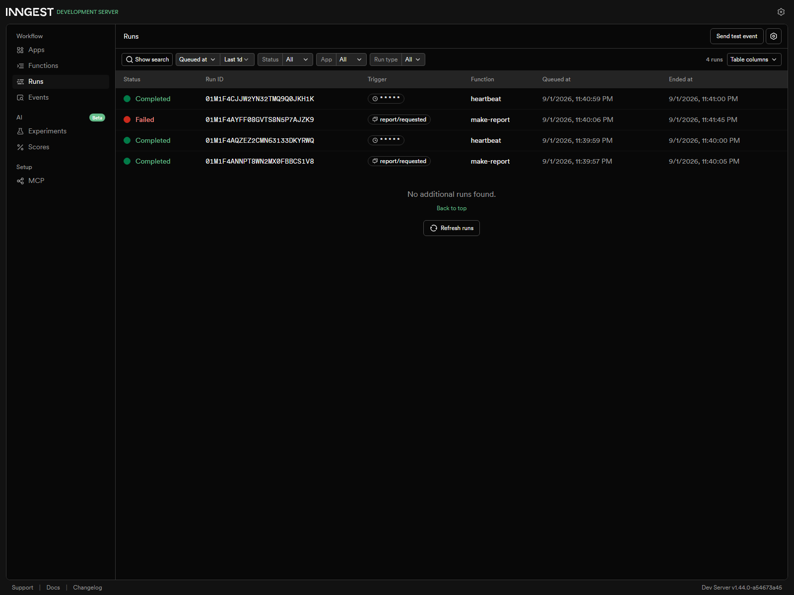

# A3 — Your First Background Job

This assignment demonstrates the **accept fast, work in the background, report status** pattern using FastAPI and Inngest. `POST /reports` acknowledges valid work immediately with HTTP `202 Accepted`, while Inngest performs the slow operation separately. The client checks progress with `GET /reports/{id}`.

## Run locally

Use two terminals.

### Terminal 1 — FastAPI

```powershell
cd background-job
python -m venv .venv
.\.venv\Scripts\python.exe -m pip install -r requirements.txt
$env:INNGEST_DEV="1"
.\.venv\Scripts\python.exe -m uvicorn main:app --reload --port 8000
```

The API runs at:

```text
http://localhost:8000
```

### Terminal 2 — Inngest Dev Server

```powershell
cd background-job
npx --ignore-scripts=false inngest-cli@latest dev --no-discovery -u http://localhost:8000/api/inngest
```

The local dashboard runs at:

```text
http://localhost:8288
```

## Endpoints

| Method | Endpoint | Purpose |
|---|---|---|
| GET | `/health` | Returns `{"status":"ok"}` |
| POST | `/reports` | Validates input, creates a pending report, sends `report/requested`, and returns HTTP `202` immediately |
| GET | `/reports/{id}` | Returns the current report state |
| GET/PUT/POST | `/api/inngest` | Inngest SDK serve endpoint |

An unknown report id returns HTTP `404`.

A missing, blank, or non-string `topic` returns HTTP `400` before an Inngest event is sent.

## Inngest functions

| Function | Trigger | Work |
|---|---|---|
| `say-hello` | event `test/hello` | Durable 5-second sleep, then returns `Hello from the background!` |
| `make-report` | event `report/requested` | Durable 8-second sleep followed by `build-report`; configured with `retries=2` |
| `heartbeat` | cron `* * * * *` | Runs every minute and logs counts of pending, done, and failed reports |

## Stage 2 proof — 202 → pending → done

The final verification run measured the POST as **39.1 ms**. The required checkpoint is under one second.

### POST `/reports`

Request:

```json
{
  "topic": "cats"
}
```

HTTP `202 Accepted` response:

```json
{
  "id": "12454f3eab8d47b68d327d040088c21e",
  "status": "pending"
}
```

### First poll

`GET /reports/12454f3eab8d47b68d327d040088c21e`

```json
{
  "id": "12454f3eab8d47b68d327d040088c21e",
  "topic": "cats",
  "status": "pending"
}
```

### Later poll

After the Inngest `do-the-slow-work` 8-second step and the `build-report` step complete:

```json
{
  "id": "12454f3eab8d47b68d327d040088c21e",
  "topic": "cats",
  "status": "done",
  "result": "Background report about cats is ready."
}
```

The important behavior is that the HTTP request does **not** wait for the slow operation. The background worker completes it later.

## Stage 3 proof — validation and retries

The special topic `fail` deliberately raises:

```text
The report oven is broken!
```

The `make-report` function uses:

```python
retries=2
```

That produces **3 attempts total**: the initial attempt plus two retries.

Final failed report state from the verification run:

```json
{
  "id": "aa277fbbedd94aa1a4cbe8e5a6704277",
  "topic": "fail",
  "status": "failed",
  "attempts": 3,
  "error": "The report oven is broken!"
}
```

**Bad input vs transient failure:** invalid input is rejected immediately because retrying invalid data cannot make it valid. Retries are appropriate after valid work has been accepted but execution may fail temporarily.

## Stage 4 proof — cron heartbeat

The heartbeat trigger is:

```text
* * * * *
```

That means **every minute**. The final verification session observed **2 heartbeat runs**. Each run logs a summary containing the number of reports in `pending`, `done`, and `failed` states.

Required cron expressions:

- Every day at 08:00: `0 8 * * *`
- Every Sunday at 22:00: `0 22 * * 0`

The clock is the only trigger for `heartbeat`; there is no API endpoint or event that starts it.

## Dashboard evidence

The screenshot below was captured from the local Inngest Dev Server after the final verification run.



## Architecture

```text
POST /reports
    |
    v
202 Accepted + report id
    |
    v
report/requested event
    |
    v
Inngest make-report
    |
    +--> do-the-slow-work (8 seconds)
    |
    +--> build-report
    |
    v
pending -> done
```

For the deliberate failure path, Inngest retries the function twice before the run ends failed.

## Files

- `main.py` — FastAPI endpoints and the three Inngest functions
- `requirements.txt` — pinned Python dependencies
- `docs/inngest-dashboard.png` — dashboard evidence
- `.gitignore` — excludes the virtual environment, caches, and local Inngest development state

## Submission

This assignment is stored in the `background-job/` folder of the public repository. The implementation was built across separate stage commits so the development history is visible.