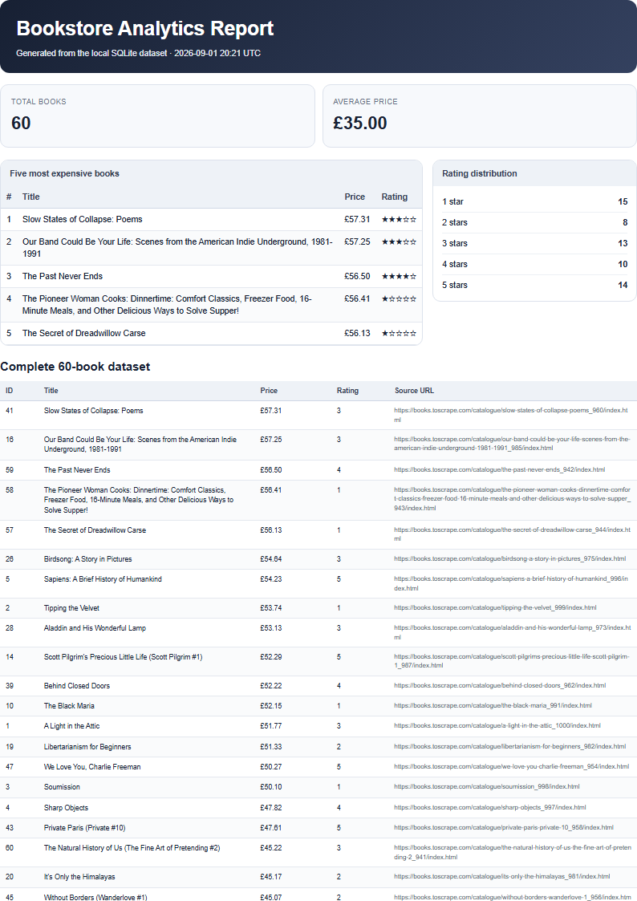

# PDF Report Generator

FlyRank Internship — Backend Track — Assignment A8.

This project is a complete synchronous data-to-document pipeline:

```text
books.json
   ↓
SQLite
   ↓
SQL aggregations
   ↓
HTML report
   ↓
Playwright / Chromium
   ↓
A4 PDF
   ↓
FastAPI metadata + download link
```

## Stack

- Python
- FastAPI
- SQLite through Python's built-in `sqlite3`
- Playwright
- Headless Chromium

No background worker is required for the core A8 implementation. `POST /reports` intentionally performs the SQL query, HTML rendering, PDF generation, and metadata persistence synchronously.

## Project structure

```text
pdf-report-generator/
├── main.py
├── seed.py
├── report_data.py
├── pdf_renderer.py
├── report_store.py
├── requirements.txt
├── .gitignore
├── README.md
└── docs/
    └── report-page1.png
```

Generated files are intentionally excluded from Git:

```text
report.db
reports/
.venv/
.dev/
```

## 1. Setup

From the repository root:

```powershell
cd pdf-report-generator
python -m venv .venv
.\.venv\Scripts\python.exe -m pip install -r requirements.txt
.\.venv\Scripts\python.exe -m playwright install chromium
```

## 2. Seed the bookstore data

The project reuses the validated 60-record dataset at:

```text
../scraper/output/books.json
```

Seed SQLite:

```powershell
.\.venv\Scripts\python.exe seed.py
```

The seed is deliberately safe to rerun:

```sql
DELETE FROM books;
```

Then all 60 records are inserted again.

Checkpoint:

```text
SELECT COUNT(*) FROM books -> 60
```

The `books` table is:

```sql
CREATE TABLE books (
    id INTEGER PRIMARY KEY AUTOINCREMENT,
    title TEXT NOT NULL,
    price REAL NOT NULL,
    rating INTEGER NOT NULL,
    url TEXT NOT NULL UNIQUE
);
```

## 3. SQL aggregation layer

Run:

```powershell
.\.venv\Scripts\python.exe report_data.py
```

### Total books and average price

```sql
SELECT
    COUNT(*) AS total_books,
    ROUND(AVG(price), 2) AS average_price
FROM books;
```

Final verified values:

- Total books: **60**
- Average price: **£35.00**

### Five most expensive books

```sql
SELECT title, price, rating, url
FROM books
ORDER BY price DESC, title ASC
LIMIT 5;
```

| # | Book | Price | Rating |
|---:|---|---:|---:|
| 1 | Slow States of Collapse: Poems | £57.31 | 3 |
| 2 | Our Band Could Be Your Life: Scenes from the American Indie Underground, 1981-1991 | £57.25 | 3 |
| 3 | The Past Never Ends | £56.50 | 4 |
| 4 | The Pioneer Woman Cooks: Dinnertime: Comfort Classics, Freezer Food, 16-Minute Meals, and Other Delicious Ways to Solve Supper! | £56.41 | 1 |
| 5 | The Secret of Dreadwillow Carse | £56.13 | 1 |

### Rating distribution

```sql
SELECT rating, COUNT(*) AS book_count
FROM books
GROUP BY rating
ORDER BY rating ASC;
```

| Rating | Count |
|---:|---:|
| 1 | 15 |
| 2 | 8 |
| 3 | 13 |
| 4 | 10 |
| 5 | 14 |

The rating counts add up to **60**.

## 4. HTML → PDF

Generate a standalone checkpoint PDF:

```powershell
.\.venv\Scripts\python.exe pdf_renderer.py --output reports/test.pdf
```

Playwright prints the HTML using:

```python
page.pdf(
    path=str(output_path),
    format="A4",
    print_background=True,
    prefer_css_page_size=True,
)
```

The report contains:

- total book count
- average price
- five most expensive books
- rating distribution
- the complete 60-book table

Print-safe table rules include:

```css
thead {
  display: table-header-group;
}

tr {
  break-inside: avoid;
  page-break-inside: avoid;
}
```

The full table produces a multi-page PDF, the table header repeats on later pages, and individual rows are protected from splitting across page boundaries.

## Report page-1 evidence



## 5. Run the API

Start FastAPI:

```powershell
.\.venv\Scripts\python.exe -m uvicorn main:app --reload --port 8000
```

Endpoints:

| Method | Endpoint | Behavior |
|---|---|---|
| GET | `/health` | health check |
| POST | `/reports` | generate or reuse today's report |
| GET | `/reports/{id}` | return persisted report metadata |
| GET | `/reports/{id}/file` | download the generated PDF |

The metadata table is:

```sql
CREATE TABLE reports (
    id INTEGER PRIMARY KEY AUTOINCREMENT,
    path TEXT NOT NULL,
    created_at TEXT NOT NULL
);
```

Unknown report IDs return HTTP `404`.

## 6. Final live API proof

The final Stage 6 verification was run against the actual FastAPI application.

### First normal POST — generate

```http
POST /reports
HTTP 201 Created
```

```json
{
  "id": 1,
  "created_at": "2026-09-01T20:21:07.572692+00:00",
  "file_url": "/reports/1/file",
  "reused": false
}
```

Generated file:

```text
reports/1.pdf
```

Verified PDF size: **90546 bytes**.

### Second normal POST — reuse

A second normal request on the same UTC day returned:

```http
POST /reports
HTTP 200 OK
```

```json
{
  "id": 1,
  "created_at": "2026-09-01T20:21:07.572692+00:00",
  "file_url": "/reports/1/file",
  "reused": true
}
```

The report ID stayed the same and no second PDF was generated.

### Force a fresh report

Request:

```json
{
  "force": true
}
```

Response:

```http
POST /reports
HTTP 201 Created
```

```json
{
  "id": 2,
  "created_at": "2026-09-01T20:21:09.232565+00:00",
  "file_url": "/reports/2/file",
  "reused": false
}
```

Generated file:

```text
reports/2.pdf
```

Verified PDF size: **90546 bytes**.

The forced report has a different ID from the normal daily report.

## Why the idempotency rule exists

A normal `POST /reports` is safe to retry: once a report already exists for the current UTC day, the API returns that report with HTTP `200` instead of creating a duplicate.

`{"force": true}` is the explicit override when the caller deliberately wants a fresh PDF snapshot.

## Direct download

Example:

```powershell
curl.exe http://localhost:8000/reports/1/file --output report.pdf
```

The final checkpoint verified that this endpoint returned HTTP `200`, `application/pdf`, and valid bytes beginning with `%PDF-`.

## Submission notes

- Data source: 60 validated bookstore records
- SQLite seed: reproducible and safe to rerun
- Required aggregations: implemented in SQL
- PDF: A4, multi-page, print backgrounds enabled
- Repeating table header: implemented
- Row page-break protection: implemented
- `POST /reports`: synchronous generation
- Metadata lookup: implemented
- PDF download: implemented
- Unknown IDs: HTTP `404`
- Daily idempotency: implemented
- `force:true` override: implemented
- `report.db`: ignored
- `reports/`: ignored
- Public Git history: 7 staged assignment commits